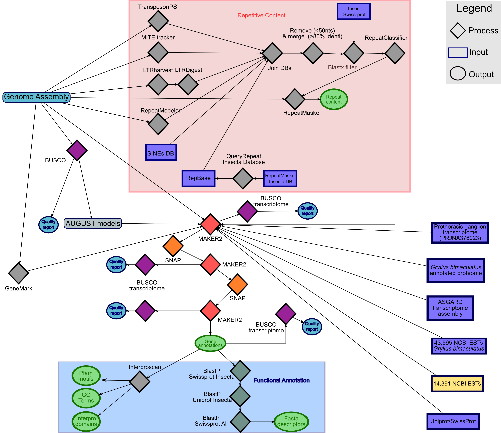

# *Laupala kohalensis* genome annotation.

- The annotation pipline is split in 3 parts:

	- [Repeat_Content.md](Repeat_Content.md): To construct a custom  repeat library to mask repeats with RepeatMasker. 
	- Protein coding gene annotation
	- Functional annotations

- This pipeline is based on the pipline I used for the cricket *Gryllus bimaculatus*. **Please see the [*G. bimaculatus* pipeline](https://github.com/guillemylla/Crickets_Genome_Annotation_Public/tree/master/G_bimaculatus) for more metodological details**.

- Schematic representation of the *L. kohalensis* annotation pipeline.

