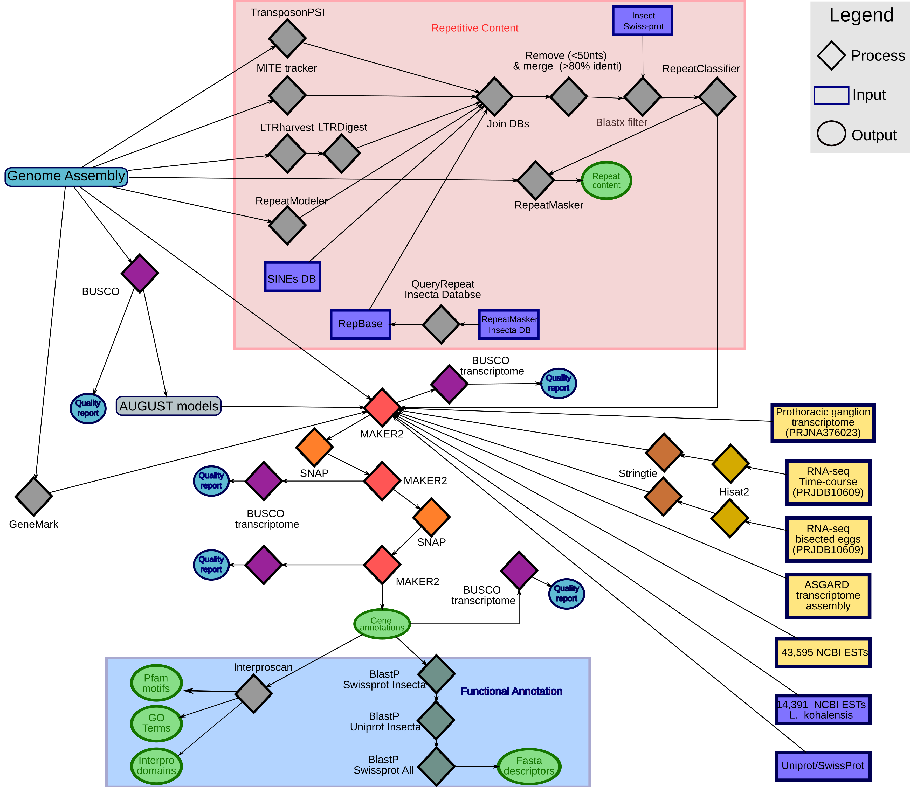

# Crickets Genome Annotation Scripts

--------------

- Scripts author: [Guillem Ylla](https://guillemylla.github.io/)
- Preprint: [**"Insights into the genomic evolution of insects from cricket genomes"**](https://www.biorxiv.org/content/10.1101/2020.07.07.191841v2)
- Genome database: https://gbimaculatusgenome.rc.fas.harvard.edu 
------

This repository includes:

1. Compilation of scripts used for the *de novo* annotating the genomes of the crickets:
	- [*Gryllus bimaculatus*](G_bimaculatus)
	- [*Laupala kohalensis*](L_kohalensis)
2. The [Analysis directory](Analysis) contains the scripts used to analyze these genomes and generate the results shown  publication.
3. The [Annotation_files direcotry](Annotation_files)  contains the annotations (gff3 files) for *G. bimaculatus* and *L. kohalensis*

-----

- The genome annotation pipeline involves:
	- **Repeat masking** with [RepeatMasker](http://www.repeatmasker.org/) using a custom repear library generated by combining 5 different tools.
	- **Protein coding genes annotation** based on [MAKER2 pipeline](https://www.yandell-lab.org/software/maker.html).
	- **Functional annotation** based on InterProscan and Blast, and creation of a SQL database.

- Pipeline based on the multiple online sources. Most relevant resources used:
	 - [MAKER tutorial](http://weatherby.genetics.utah.edu/MAKER/wiki/index.php/MAKER_Tutorial_for_WGS_Assembly_and_Annotation_Winter_School_2018)
	 - [MAKER tutorial to create custom repeat libaries](http://weatherby.genetics.utah.edu/MAKER/wiki/index.php/Repeat_Library_Construction-Advanced)
	 - Daren Card pipline for annotating the *Boa constrictor* genome (https://gist.github.com/darencard/bb1001ac1532dd4225b030cf0cd61ce2)

- The annotation pipline used in both crickets is very similar. If you would like to use it for any other species, I recommend you to check the [*G. bimaculatus*](https://github.com/guillemylla/Crickets_Genome_Annotation_Public/tree/master/G_bimaculatus) one, since the scripts are better explained.

- Schematic representation of the *G. bimaculatus* genoem annotation:

- Please cite: 
- Preprint citation: Ylla, et al. (2020). Insights into the genomic evolution of insects from cricket genomes. bioRxiv. https://doi.org/10.1101/2020.07.07.191841
